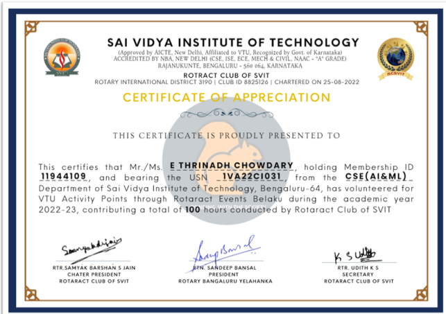
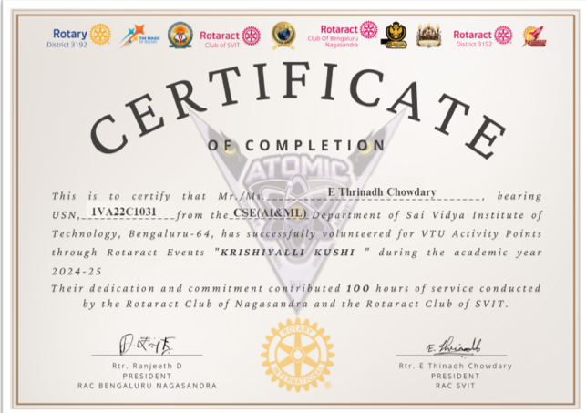
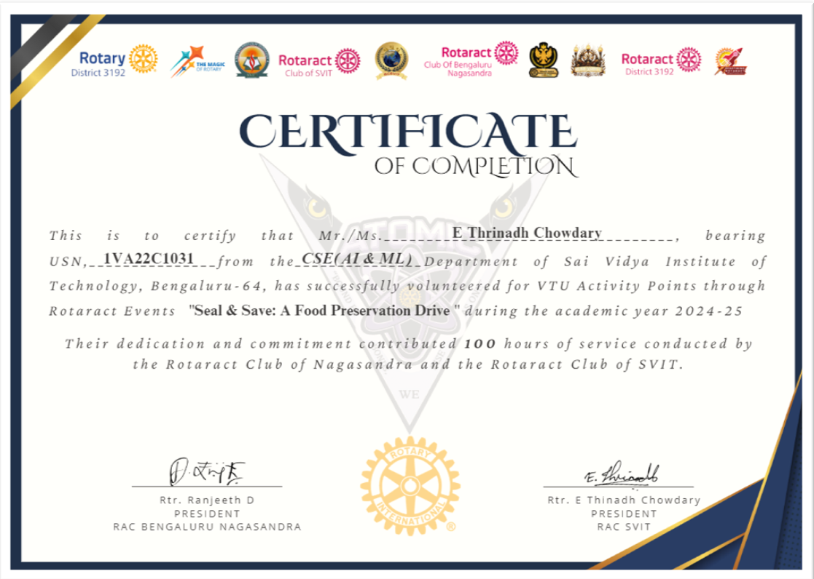
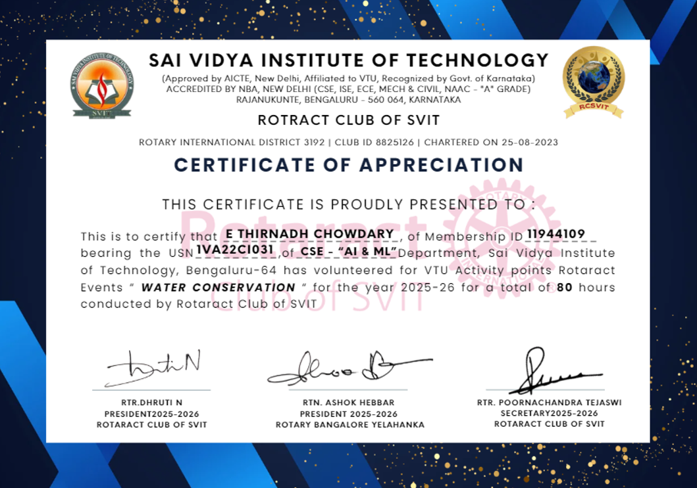

# 🏆 My Certifications & Achievements

### E Thrinadh Chowdary
**BE CSE (AI & ML) Graduate | Full-Stack Developer | AI/ML Enthusiast**

---

*A curated collection of my professional certifications, course completions, hackathon participations, and community service recognitions.*

---

## 📑 Table of Contents

- [☁️ Technical / Course Completion](#️-technical--course-completion)
- [🏆 Hackathons & Events](#-hackathons--events)
- [🤝 Community Service & Volunteering](#-community-service--volunteering)
- [🎓 Leadership & Academic](#-leadership--academic)
- [🚧 Coming Soon](#-coming-soon)

---

## ☁️ Technical / Course Completion

| # | Certification | Issued By | Date |
|:-:|---|---|---|
| 1 | **Google Cloud Career Launchpad** — Generative AI Leader Track | Google Cloud | 2025 |
| 2 | **Getting Started with Data** | IBM SkillsBuild | Dec 2025 |

📄 View Certificates

 

| Google Cloud — Gen AI Leader Track | IBM SkillsBuild — Data |
|:---:|:---:|
|  |  |

---

## 🏆 Hackathons & Events

| # | Event | Organized By | Date |
|:-:|---|---|---|
| 1 | **EY Techathon 4.0** — Round 1 Participation | Ernst & Young (EY) | 2024–2025 |
| 2 | **TCS TechBytes** — Campus Event | Tata Consultancy Services | 2024–2025 |
| 3 | **AIGINITION Hackathon** — Participation | AIGINITION | Nov 2025 |
| 4 | **Sanchalana 2023** — Aircrash & Ludo Events | SVIT (State Level Cultural Fest) | Jun 2023 |
| 5 | **Vignanothsav 2023** — Participation | SVIT | 2023 |

📄 View Certificates

 

| EY Techathon 4.0 | TCS TechBytes |
|:---:|:---:|
|  |  |

| AIGINITION Hackathon |
|:---:|
|  |

**Sanchalana 2023 — Cultural Fest Events**

| Aircrash Event | Ludo Event |
|:---:|:---:|
|  |  |

| Vignanothsav 2023 |
|:---:|
|  |

---

## 🤝 Community Service & Volunteering

| # | Activity | Associated With | Date |
|:-:|---|---|---|
| 1 | **Cleanliness Drive** — Participation | Rotaract / College | 2024 |
| 2 | **Polio Awareness Campaign** — Participation | Rotaract Club | Oct 2024 |
| 3 | **INOCON 2023** — IEEE International Conference Volunteer | IEEE Bangalore Section, SVIT | Mar 2023 |
| 4 | **Cultural Activities Volunteering** | Govt High School, Rajanukunte | 2023–2024 |
| 5 | **Belaku Volunteering** | Rotaract Club of SVIT | 2022–2023 |
| 6 | **Krishiyalli Kushi Volunteering** | Rotaract Club of SVIT | 2024–2025 |
| 7 | **Seal & Save Food Preservation Drive** | Rotaract Club of SVIT | 2024–2025 |
| 8 | **Water Conservation Volunteering** | Rotaract Club of SVIT | 2025–2026 |

📄 View Certificates

 

| Cleanliness Drive | Polio Awareness |
|:---:|:---:|
|  |  |

| INOCON 2023 — IEEE Volunteer (Certificate of Appreciation) |
|:---:|
|  |

**VTU Activity Points / Volunteering**

| Cultural Activities (2023-24) | Belaku (2022-23) | Krishiyalli Kushi (2024-25) |
|:---:|:---:|:---:|
|  |  |  |

| Seal & Save Drive (2024-25) | Water Conservation (2025-26) |
|:---:|:---:|
|  |  |

---

## 🎓 Leadership & Academic

| # | Certification | Issued By | Date |
|:-:|---|---|---|
| 1 | **Sanchalana Coordination** — College Event | College / University | May 2024 |
| 2 | **Areas of Focus** — Rotary Learning | Rotary International | Dec 2024 |
| 3 | **SPARK** — Rotaract Leadership Training (Certificate of Graduation) | Rotaract District 3192 | Jun 2024 |

📄 View Certificates

 

| Sanchalana Coordination | Rotary — Areas of Focus |
|:---:|:---:|
|  |  |

| SPARK — Rotaract Leadership Training (Graduation) |
|:---:|
|  |

---

## 🚧 Coming Soon

> **This repository is actively updated!** I'm continuously earning new certifications and participating in events. Stay tuned for more additions across:
>
> - 🤖 AI / Machine Learning Certifications
> - 💻 Full-Stack Development Courses
> - 📱 Android Development
> - ☁️ Cloud Platforms (AWS, Azure, GCP)
> - 🏅 More Hackathons & Competitions

---

## 📊 Summary

| Category | Count |
|---|:---:|
| ☁️ Technical / Course Completion | 2 |
| 🏆 Hackathons & Events | 5 |
| 🤝 Community Service & Volunteering | 8 |
| 🎓 Leadership & Academic | 3 |
| **Total** | **18** |

---

### 🔗 Let's Connect!

---

*⭐ If you find this repository useful or inspiring, feel free to star it!*

